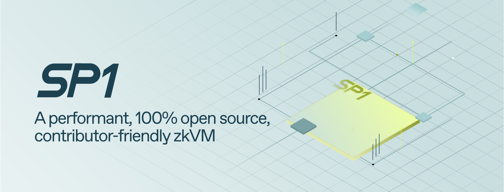

# SP1

[![Telegram Chat][tg-badge]][tg-url]

SP1 is a performant, 100% open-source, contributor-friendly zero-knowledge virtual machine (zkVM) that can prove the execution of arbitrary Rust (or any LLVM-compiled language) programs. SP1 democratizes access to ZKPs by allowing developers to use programmable truth with popular programming languages.

SP1 is inspired by the open-source software movement and takes a collaborative approach towards building the best zkVM for rollups, coprocessors and other ZKP applications. We envision a diversity of contributors integrating the latest ZK innovations, creating a zkVM that is _performant_, _customizable_ and will stand the _test of time_.

**[Install](https://succinctlabs.github.io/sp1/getting-started/install.html)**
| [Docs](https://succinctlabs.github.io/sp1)
| [Examples](https://github.com/succinctlabs/sp1/tree/main/examples)

[tg-badge]: https://img.shields.io/endpoint?color=neon&logo=telegram&label=chat&url=https://tg.sumanjay.workers.dev/succinct_sp1
[tg-url]: https://t.me/succinct_sp1

## For Developers: Build with SP1

**Note that SP1 is still in alpha and is not yet ready for production use.**

Today, developers can write programs, including complex, large programs like a ZK Tendermint light client, in Rust (with std support), generate proofs and verify them. Most Rust crates should be supported and can be used seamlessly by your program. Example programs can be found in the [examples](https://github.com/succinctlabs/sp1/tree/main/examples) folder.

To get started, make sure you have [Rust](https://www.rust-lang.org/tools/install) installed. Then follow the [installation](https://succinctlabs.github.io/sp1/getting-started/install.html) guide in the SP1 book and read the [getting started](https://succinctlabs.github.io/sp1/getting-started/quickstart.html) section.

For developers looking for inspiration on what to build, check out the open issues with the [showcase](https://github.com/succinctlabs/sp1/issues?q=is%3Aopen+is%3Aissue+label%3Ashowcase) label to see what sorts of programs that showcase the capabilities of SP1 are interesting to hack on.

## For Contributors

Open-source is a core part of SP1's ethos and key to its advantages. We wish to cultivate a vibrant community of open-source contributors that span individuals, teams and geographies. If you want to contribute, or follow along with contributor discussion, you can use our main Telegram to chat with us. Our contributor guidelines can be found in [CONTRIBUTING.md](./CONTRIBUTING.md).

Find a list of [good first issues](https://github.com/succinctlabs/sp1/issues?q=is%3Aopen+is%3Aissue+label%3A%22good+first+issue%22+) in the open issues of this repo. We are always looking for contributors interested in tasks big and small, including minor chores across the codebase, optimizing performance, adding precompiles for commonly used cryptographic operations, adding documentation, creating new example programs and more. Please reach out in the Telegram chat if interested!

## Roadmap

Today, SP1 can generate and verify proofs for Rust programs that have been compiled to RISC-V. SP1 supports proving of programs of arbitrary length by using a unique "shared challenges" argument that allows the prover to shard a long computation into small shards, and then generate a global proof that these shards are properly connected together.

The main priorities in the next few months are performance optimizations, getting the core zkVM constraint logic audited, as well as wrapping the SP1 STARK proof into a SNARK proof that is cheaply verifiable in the EVM (by adapting similar [previous work](https://github.com/succinctlabs/gnark-plonky2-verifier) done by the Succinct Team).

## Acknowledgements

We would like to acknowledge the projects below whose previous work has been instrumental in making this project a reality:

- [Plonky3](https://github.com/Plonky3/Plonky3): The SP1's prover is powered by the Plonky3 toolkit.
- [Valida](https://github.com/valida-xyz/valida): The SP1 cross-table lookup architecture, prover, borrow macro, and chip design are inspired by Valida.
- [RISC0](https://github.com/risc0/risc0): The SP1 Rust toolchain and install/build scripts for the toolchain borrow code from RISC0.

## Tips

We recommend you install the [rust-analyzer](https://marketplace.visualstudio.com/items?itemName=rust-lang.rust-analyzer) extension.
Note that if you use `cargo prove new` inside a monorepo, you will need to add the manifest file to `rust-analyzer.linkedProjects` to get full IDE support.
