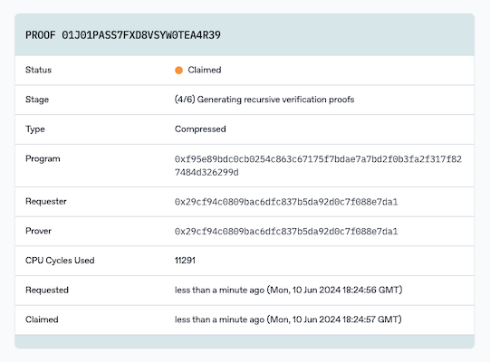

# Generating Proofs: Prover Network

In the case that you do not want to prove locally, you can use the Succinct prover network to generate proofs.

**Note:** The network is still in development and should be only used for testing purposes.

## Sending a proof request

To use the prover network to generate a proof, you can run your script as you would normally but with additional environment variables set:

```sh
SP1_PROVER=network SP1_PRIVATE_KEY=... RUST_LOG=info cargo run --release
```

- `SP1_PROVER` should be set to `network` when using the prover network.

- `SP1_PRIVATE_KEY` should be set to your [private key](#key-setup). You will need
  to be using a [whitelisted](#getting-whitelisted) key to use the network.

When you call a prove function in ProverClient, it will first simulate your program, then submit it for a prover to claim the request and start generating a proof. It will then wait for a proof to be generated.

## Key Setup

The prover network uses secp256k1 signatures for authentication. You may generate a new keypair
explicitly for use with the prover network, or used an existing keypair.

There is no need for this keypair to hold funds. Its role is solely for authentication purposes,
functioning as a unique identifier for your account.

Prover network keypair credentials can be generated using the [cast](https://book.getfoundry.sh/cast/) CLI tool:

```sh
cast wallet new
```

or retieve your address from an existing key:

```sh
cast wallet address --private-key $SP1_PRIVATE_KEY
```

The private key should be set to `SP1_PRIVATE_KEY`, which should be kept safe and secure. Only your address can be shared publicly.

## Get access

Currently the network is permissioned, so you need to gain access through Succinct. After you have completed the [key setup](#key-setup), you can submit your address in this [form](https://docs.google.com/forms/d/e/1FAIpQLSd-X9uH7G0bvXH_kjptnQtNil8L4dumrVPpFE4t8Ci1XT1GaQ/viewform?vc=0&c=0&w=1&flr=0&usp=mail_form_link) and we'll contact you shortly.

## View the status of your proof

You can view your proof and other running proofs on the [explorer](https://explorer.succinct.xyz/). The page for your proof will show details such as the stage of your proof and the cycles used. It also shows the program hash which is the keccak256 of the program bytes.



## Advanced Usage

### Skip simulation

To skip the simulation step and directly submit the program for proof generation, you can set the `SKIP_SIMULATION` environment variable to `true`. This will save some time if you are sure that your program is correct. If your program panics, the proof will fail and ProverClient will panic.

### Use NetworkProver directly

By using the `sp1_sdk::NetworkProver` struct directly, you can call async functions directly and have programmatic access to the proof ID.

```rust,noplayground
impl NetworkProver {
    /// Creates a new [NetworkProver] with the private key set in `SP1_PRIVATE_KEY`.
    pub fn new() -> Self;

    /// Creates a new [NetworkProver] with the given private key.
    pub fn new_from_key(private_key: &str) -> Self;

    /// Requests a proof from the prover network, returning the proof ID.
    pub async fn request_proof(
        &self,
        elf: &[u8],
        stdin: SP1Stdin,
        mode: ProofMode,
    ) -> Result<String>;

    /// Waits for a proof to be generated and returns the proof.
    pub async fn wait_proof<P: DeserializeOwned>(&self, proof_id: &str) -> Result<P>;

    /// Requests a proof from the prover network and waits for it to be generated.
    pub async fn prove<P: ProofType>(&self, elf: &[u8], stdin: SP1Stdin) -> Result<P>;
}
```
