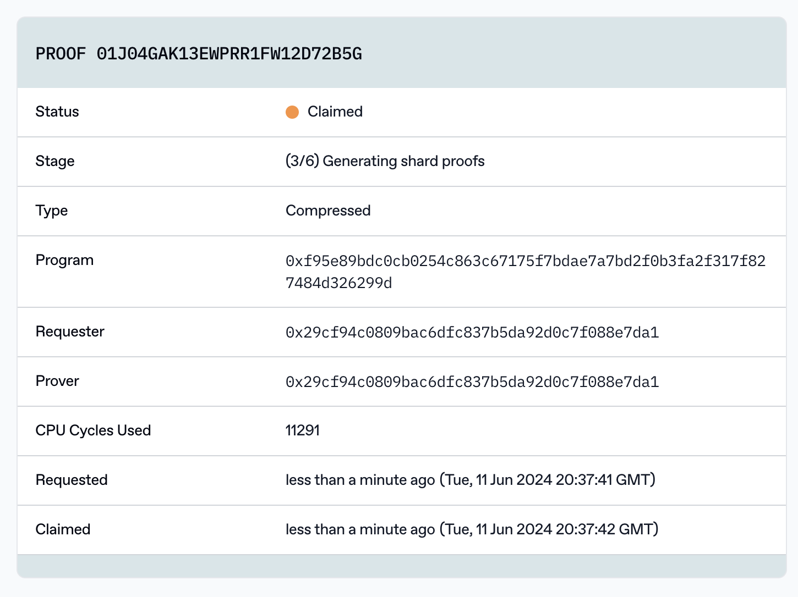

# Prover Network: Usage

## Sending a proof request

To use the prover network to generate a proof, you can run your script that uses `sp1_sdk::ProverClient` as you would normally but with additional environment variables set:

```rust,noplayground
// Generate the proof for the given program.
let client = ProverClient::new();
let (pk, vk) = client.setup(ELF);
let mut proof = client.prove(&pk, stdin).run().unwrap();
```

```sh
SP1_PROVER=network SP1_PRIVATE_KEY=... RUST_LOG=info cargo run --release
```

- `SP1_PROVER` should be set to `network` when using the prover network.

- `SP1_PRIVATE_KEY` should be set to your [private key](./setup.md#key-setup). You will need
  to be using a [permissioned](./setup.md#get-access) key to use the network.

When you call any of the prove functions in ProverClient now, it will first simulate your program, then wait for it to be proven through the network and finally return the proof.

## View the status of your proof

You can view your proof and other running proofs on the [explorer](https://explorer.succinct.xyz/). The page for your proof will show details such as the stage of your proof and the cycles used. It also shows the program hash which is the keccak256 of the program bytes.



## Advanced Usage

### Skip simulation

To skip the simulation step and directly submit the program for proof generation, you can set the `SKIP_SIMULATION` environment variable to `true`. This will save some time if you are sure that your program is correct. If your program panics, the proof will fail and ProverClient will panic.

### Use NetworkProver directly

By using the `sp1_sdk::NetworkProver` struct directly, you can call async functions directly and have programmatic access to the proof ID.

```rust,noplayground
impl NetworkProver {
    /// Creates a new [NetworkProver] with the private key set in `SP1_PRIVATE_KEY`.
    pub fn new() -> Self;

    /// Creates a new [NetworkProver] with the given private key.
    pub fn new_from_key(private_key: &str) -> Self;

    /// Requests a proof from the prover network, returning the proof ID.
    pub async fn request_proof(
        &self,
        elf: &[u8],
        stdin: SP1Stdin,
        mode: ProofMode,
    ) -> Result<String>;

    /// Waits for a proof to be generated and returns the proof.
    pub async fn wait_proof<P: DeserializeOwned>(&self, proof_id: &str) -> Result<P>;

    /// Requests a proof from the prover network and waits for it to be generated.
    pub async fn prove<P: ProofType>(&self, elf: &[u8], stdin: SP1Stdin) -> Result<P>;
}
```
